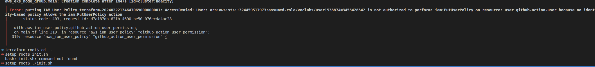

<details open>
<summary><b>Change 1:</b> Replace the content to the following</summary>

Only complete these steps once you've finished your Continuous Integration pipelines for the frontend and backend applications. 

In this step, you will create Docker container repositories through Amazon Elastic Container Registry (ECR) and a Kubernetes environment in Amazon Elastic Kubernetes Service (EKS) to deploy the applications to and verify the deployment step.

You may do this directly via AWS console, or by running a Terraform template provided in the project repository.

In your workflow, you may use <a href="https://github.com/aws-actions/amazon-ecr-login" target="_blank">aws-actions/amazon-ecr-login</a> GitHub Action to log in to ECR and push to your repositories.

## Option 1: Setting up via AWS Console

1. Create two private repositories in Amazon ECR. One for the frontend app, another one for the backend app
1. Create one Kubernetes cluster in Amazon EKS to deploy your applications to

## Option 2. Setting up via Terraform

### Step 1. Install tfenv and an appropriate version of Terraform

The workspace does not currently have an appropriate version of Terraform, so you'll need to run the following commands in your terminal to set up the correct version:

```bash
git clone https://github.com/tfutils/tfenv.git ~/.tfenv
export PATH="$HOME/.tfenv/bin:$PATH"
source ~/.bashrc
tfenv install 1.3.9
tfenv use 1.3.9
cd /workspace/setup/terraform
terraform init
```

### Step 2. Create an administrator user in AWS

1. Go to the IAM console and create a new user. Give this user an Administrator Role.
2. Go to this new user's page, open up its "Security credentials" tab, and then click on "Create access key".
3. Apply Terraform template as this user in the next step.

### Step 3. Create AWS infrastructure with Terraform

Copy the access key and secret access key into the following environment variables in the workspace's shell:

```bash
export AWS_ACCESS_KEY_ID={copied-access-key}
export AWS_SECRET_ACCESS_KEY={copied-secret-key}
```

Use the commands below to run the Terraform and type `yes` after reviewing the expected changes:

```bash
cd /workspace/setup/terraform
terraform apply
```

When successful, you should see references to the created components in your terminal, something like this:


Take note of the Terraform outputs. You'll need these later as you work on the project. You can always retrieve these values later with this command

```bash
cd setup/terraform
terraform output
```

#### Troubleshooting IAM access error when applying a Terraform template

If you get errors that look like the following:



That means you may have run `terraform apply` as a Udacity federated user account. Do step 3 above and re-run `terraform apply` as the newly created user.


### Step 4. Generate AWS access keys for GitHub Actions

Generate AWS credentials for the IAM user account that GitHub Actions will use to interact with your AWS account.

1. Launch the Cloud Gateway and go to the IAM service.
1. Under users, you should only see the `github-action-user` user account
1. Click the account and go to `Security Credentials`
1. Under `Access keys`  select `Create access key`
1. Select `Application running outside AWS` and click `Next`, then `Create access key` to finish creating the keys
1. On the last page, make sure to copy/paste these keys for storing in Github Secrets

### Step 5. Add GitHub Action user to Kubernetes

Add the `github-action-user` IAM user ARN to the Kubernetes configuration to allow that user to execute `kubectl` commands against the cluster. To do this, run the `init.sh` helper script in the `setup` folder

```bash
cd setup
./init.sh
```

The script does the following:

1. Fetches the ARN (Amazon Resource Name) for a specific IAM (Identity and Access Management) user named `github-action-user` using the AWS CLI, and stores it in a variable named `userarn`.
2. Downloads a specific version (v0.6.2) of the AWS IAM Authenticator for Kubernetes, makes it executable, and then uses it to update the AWS IAM role/user permissions. Specifically, it adds the IAM user to the Kubernetes cluster with the role or username `github-action-role` and assigns it to the `system:masters group`, which typically has full access to the cluster.
3. Cleans up by removing the downloaded AWS IAM Authenticator binary.

You only need to do this operation once. Therefore, you may run this shell script directly in your terminal.

</details>


