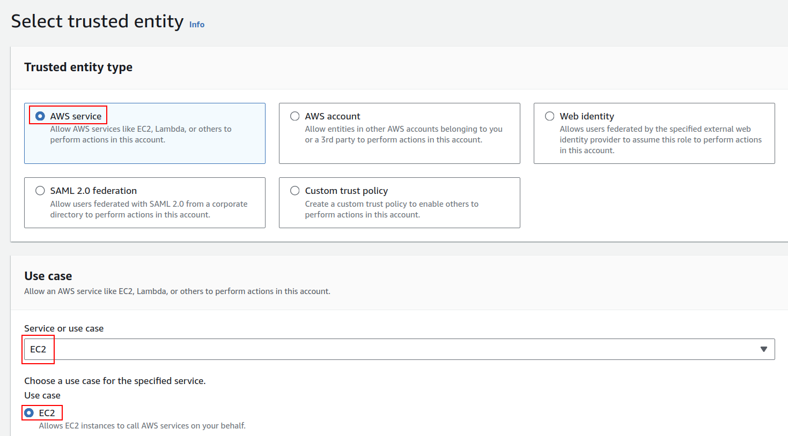

## Creating an IAM role to manage the node group

**Step 1:** Select **AWS Service** as the trusted entity type. In the use case section, choose "EC2" as the AWS service that will use this role. This is because EKS worker nodes are EC2 instances that require permissions to interact with AWS services on your behalf. 

**Step 2:** Click **Next**, and on the *Add permissions* page, Add the following four policies as shown in the video above:

- AmazonEKSWorkerNodePolicy
- AmazonEC2ContainerRegistryReadOnly
- AmazonEKS_CNI_Policy
- AmazonEMRReadOnlyAccessPolicy_v2

Click **Next** again, pick a name for this role, and finally, just click on the **Create role** to create this role.
