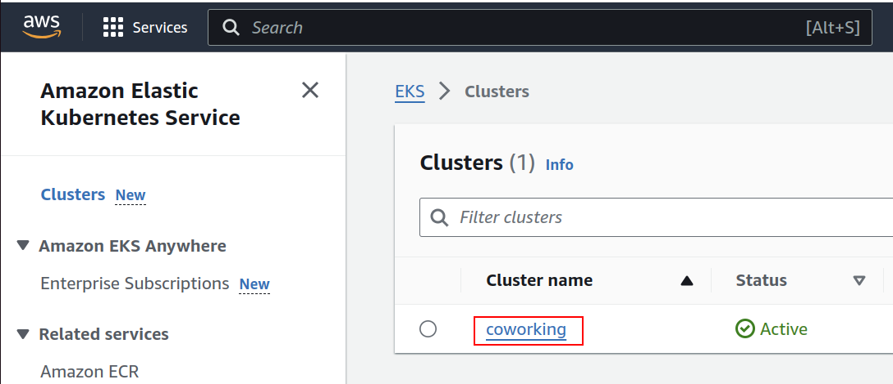
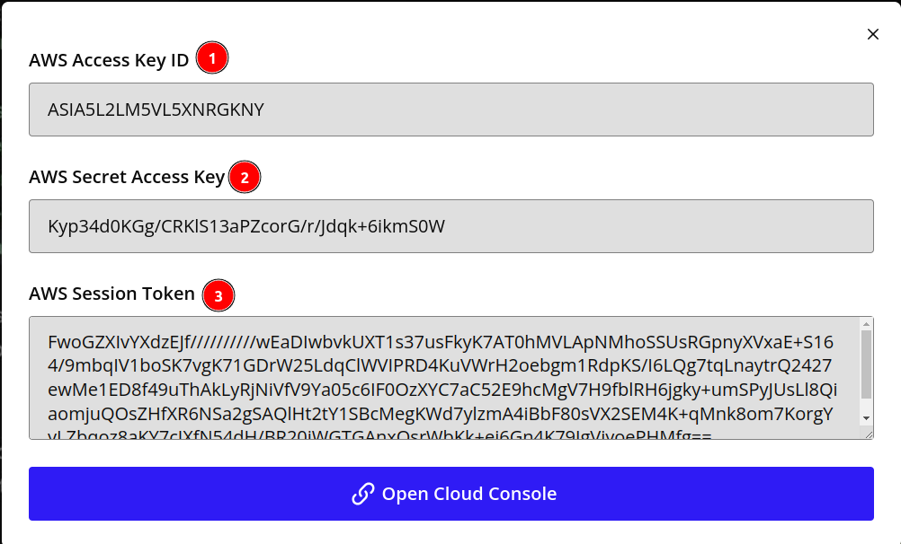

## Commands Used on This Page

### Configure `kubectl` to Interact with an Amazon EKS (Elastic Kubernetes Service) Cluster

Before running any `kubectl` commands, you need to execute the following command to ensure these commands can access your Amazon EKS cluster.

```bash
aws eks --region us-east-1 update-kubeconfig --name cluster_name
```

`cluster_name` is available from the **Clusters** page in your console:



### Print Out Cluster Information

This command prints out the statuses of your clusters.

```bash
kubectl cluster-info
```

### Create Resources in a Cluster

This command applies a YAML file to your EKS cluster.

```bash
kubectl apply -f [filename.yaml]
```

There are three ways to verify the creation of resources:

First, you may run the following command:

```bash
kubectl get pods
```

You may also verify by checking if the new services have been created with this command:

```bash
kubectl get services
```

And thirdly, you may also check out the **Resources** tab of your EKS console.

## Troubleshooting

### Error: You Must Be Logged in to the Server (Unauthorized)

You might see the following error message when running most `kubectl` commands:

```bash
error: You must be logged in to the server (Unauthorized)
```

This error suggests that the `kubectl` command-line tool is not properly authenticated with the Kubernetes cluster.

A common reason for this error is that the cluster was created through the console by a federated user account from Udacity, but attempts to access it were done by another user via the CLI.

To resolve this issue, you may run `aws configure` with the federated account from Udacity and use it to log in:



1. First, run `aws configure` and enter both the AWS Access Key ID and Secret Access Key (#1 and #2 from the screenshot above).
2. After that, run `aws configure set aws_session_token [SESSION_TOKEN]` where `SESSION_TOKEN` is taken from field #3 from the above screenshot.

After that, you may run the `aws eks update-kubeconfig` command again, and then `kubectl` commands should work correctly.
