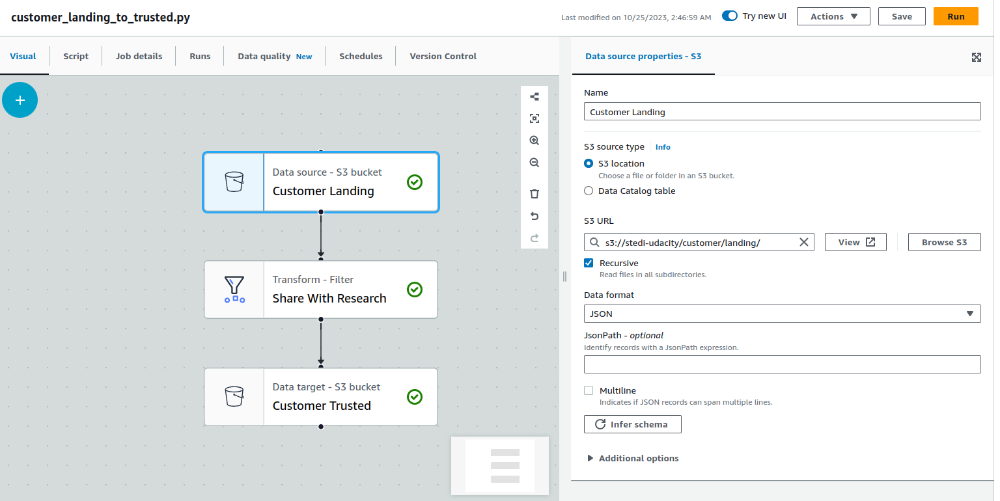

> Change 1: Replace the second image with `1-customer_landing_to_trusted.png`


> Change 2: In **Sources** section, replace the entire list with the following:

- Amazon S3
- AWS Glue Data Catalog
- Amazon DynamoDB
- Amazon Kinesis
- Apache Kafka
- Amazon Redshift
- MySQL
- PostgreSQL
- Microsoft SQL Server
- Oracle SQL
- Snowflake
- Google BigQuery

You can use either S3 or Glue Data Catalog as your data source, but the Glue Data Catalog is the better choice if you've already set it up. This is because the metadata stored in the Glue Data Catalog makes query results more predictable compared to directly querying data from S3.

> Change 3: In **Transform** section, replace the following items in the list:

- Apply Mapping -> Change Schema
- Split Fields -> Split Dataset By Fields
- Custom SQL -> SQL Query
- Detect PII -> Detect Sensitive Data

> Change 4: Add the following note under the list of nodes in the **Transform** section.

As of the time of writing, transform nodes other than the **SQL Query** node may sometimes produce inconsistent results, especially when the parent nodes have duplicates. We suggest using the **SQL Query** node whenever possible.

> Change 5: Replace the content of the **Create a Spark Job with Glue Studio** section, right after the first image:

Select either **ETL Jobs** or **Visual ETL** from the Glue Studio Menu


> Change 6: Replace the **Privacy Filter** section with the following:

## Privacy Filter

One of the most important transformations is excluding Personally Identifiable Information (PII). Glue has an out-of-the-box filter, but we are going to make our own. For the **source** in your Glue Studio Job, choose the S3 bucket you created earlier, with the folder containing the **raw** or **landing** customer data. The folder should have a forward-slash / on the end.

Click on the `+` button, then pick **Amazon S3** from the **Source** tab


*Under Node properties, name the Data source appropriately, for example: Customer Landing or Customer Raw.*



For the **transformation,** select the **SQL Query** option. In this node, write a query to filter on the *shareWithResearchAsOfDate* timestamp field, and configure it to filter out customers that have an empty *shareWithResearchAsOfDate*.

```
select * from myDataSource
where sharewithresearchasofdate is not NULL
```

*Name the Transform appropriately, for example: Share With Research*


For your destination choose an S3 location for customers who have chosen to share with research, or a **trusted zone**. The S3 bucket should be the bucket you created earlier. Any time you specify a folder that doesn't exist, S3 will automatically create it the first time data is placed there. Be sure to add the forward-slash on the end of the folder path.

Choose **Create a table in the Data Catalog and on subsequent runs, update the schema and add new partitions**. By doing this, Glue Job will update the meta data on subsequent runs. Note, however, that **Glue Jobs does not delete any data stored in the S3 bucket. You will need to manually delete the files when you need to re-run your Glue Jobs.**

Optionally, you may also pick a database and table name. *You will learn more about Glue database in the next sub-section of this course.*


> Change 7: Remove section **Extract and Load more Customer Data** (we only have one customer data file and the recursive flag is going to be explained in the next page).
