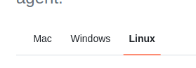

> Change 1: Replace the **Exercise Instructions** section

Follow the steps from the previous section to create a Trusted Zone for customer data. This zone will contain JSON data for customers who opted in to share their data for research. Save the generated python script in the workspace below as `customer_landing_to_trusted.py`.

Click `LAUNCH CLOUD GATEWAY` to open the AWS Console.

Note: There are two ways to upload the data into your S3 bucket:

1. As instructed in the video, through AWS CLI. Prior to doing this, you will need to [set up SSH access to your GitHub repository](https://docs.github.com/en/authentication/connecting-to-github-with-ssh/generating-a-new-ssh-key-and-adding-it-to-the-ssh-agent). When following the instructions on that page, make sure to change the tab to **Linux**.



To upload all files directly, you may use the `--recursive` flag. Assuming you are at the directory that contains `customer/`, `accelerometer/` and `step_trainer` directories, you may run the following command:

```
aws s3 cp ./ s3://stedi-udacity/ --recursive
```

2. Alternatively, you may download the files to your local computer, then upload them manually to your S3 bucket via the S3 console in AWS.

> Change 2: Add the following content **right before the second video**.

**Note:** The solution video has the following differences compared to the instructions on the previous page:

- It uses a Transform - Filter Node that filters in only data with `shareWithResearchAsOfDate != 0`. This will work, 
