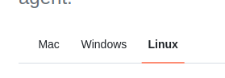

> Change 1: Add the following content in the **Exercise Instructions** section

Note: There are two ways to upload the data into your S3 bucket:

1. As instructed in the video, through AWS CLI. Prior to doing this, you will need to [set up SSH access to your GitHub repository](https://docs.github.com/en/authentication/connecting-to-github-with-ssh/generating-a-new-ssh-key-and-adding-it-to-the-ssh-agent). When following the instructions on that page, make sure to change the tab to **Linux**.



To upload all files directly, you may use the `--recursive` flag. Assuming you are at the directory that contains `customer/`, `accelerometer/` and `step_trainer` directories, you may run the following command:

```
aws s3 cp ./ s3://stedi-udacity/ --recursive
```

2. Alternatively, you may download the files to your local computer, then upload them manually to your S3 bucket via the S3 console in AWS.
