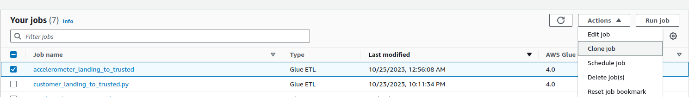

> Change 1: Replace the image

> Change 2: Update the **Modify the Job** section

### Modify the Job
- Now add a Drop Fields transform that drops the unwanted fields.
- Rename the last Node to Customer Curated.
- Change the destination to the /customer/curated/ subdirectory of the S3 bucket
- Change the destination table name.

### Drop Duplicates

Since one customer may have multiple accelerometer data, we want to drop any duplicates in the customer curated data.

To do this, you may add a Drop Duplicates transform right after the Drop Fields transform.

**Note:** You may argue that the `accelerometer_landing_to_trusted` job also need this node. Feel free to update that job if you'd like - the resulting rows are going to be the same.

### Running the job

Once you have modified the job and added a Drop Duplicate Node as suggested above, you may run the job.

**Keep** your Glue Table and S3 bucket for the customer curated zone when you are done with this exercise.
