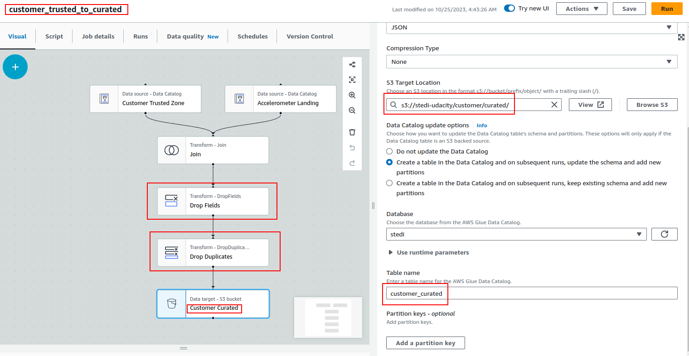
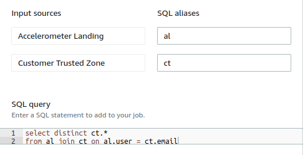
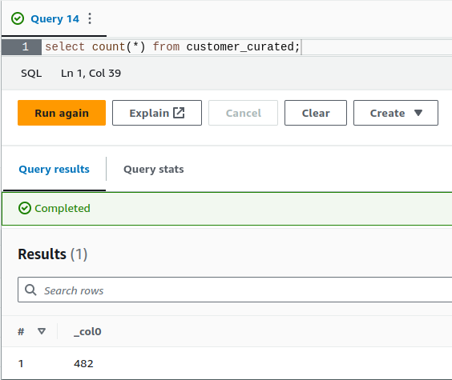

> Replace the entire content with the following.

Here is how the final Glue Job may look like, along with updated parts:



The query in the SQL Query Node could be as follows:



And running the count query in Athena should give you 482 rows, the same as customer_trusted. That means all customers had recorded accelerometer data.



`customer_trusted_to_curated.py`

```
import sys
from awsglue.transforms import *
from awsglue.utils import getResolvedOptions
from pyspark.context import SparkContext
from awsglue.context import GlueContext
from awsglue.job import Job
from awsglue import DynamicFrame


def sparkSqlQuery(glueContext, query, mapping, transformation_ctx) -> DynamicFrame:
    for alias, frame in mapping.items():
        frame.toDF().createOrReplaceTempView(alias)
    result = spark.sql(query)
    return DynamicFrame.fromDF(result, glueContext, transformation_ctx)


args = getResolvedOptions(sys.argv, ["JOB_NAME"])
sc = SparkContext()
glueContext = GlueContext(sc)
spark = glueContext.spark_session
job = Job(glueContext)
job.init(args["JOB_NAME"], args)

# Script generated for node Customer Trusted Zone
CustomerTrustedZone_node1698166718418 = glueContext.create_dynamic_frame.from_catalog(
    database="stedi",
    table_name="customer_trusted",
    transformation_ctx="CustomerTrustedZone_node1698166718418",
)

# Script generated for node Accelerometer Landing
AccelerometerLanding_node1698165620971 = glueContext.create_dynamic_frame.from_catalog(
    database="stedi",
    table_name="accelerometer_landing",
    transformation_ctx="AccelerometerLanding_node1698165620971",
)

# Script generated for node Join Customer
SqlQuery0 = """
select distinct ct.*
from al join ct on al.user = ct.email
"""
JoinCustomer_node1698165687851 = sparkSqlQuery(
    glueContext,
    query=SqlQuery0,
    mapping={
        "al": AccelerometerLanding_node1698165620971,
        "ct": CustomerTrustedZone_node1698166718418,
    },
    transformation_ctx="JoinCustomer_node1698165687851",
)

# Script generated for node Customer Curated
CustomerCurated_node1698165724731 = glueContext.getSink(
    path="s3://stedi-udacity/customer/curated/",
    connection_type="s3",
    updateBehavior="UPDATE_IN_DATABASE",
    partitionKeys=[],
    enableUpdateCatalog=True,
    transformation_ctx="CustomerCurated_node1698165724731",
)
CustomerCurated_node1698165724731.setCatalogInfo(
    catalogDatabase="stedi", catalogTableName="customer_curated"
)
CustomerCurated_node1698165724731.setFormat("json")
CustomerCurated_node1698165724731.writeFrame(JoinCustomer_node1698165687851)
job.commit()
```
