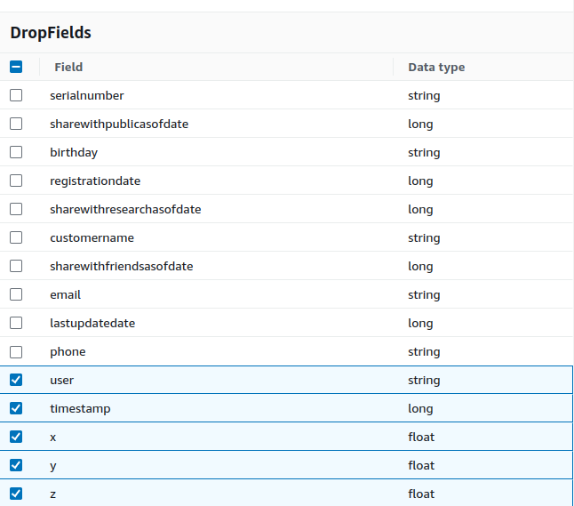

> Replace the entire content with the following.

- You will notice the Drop Fields Node is configured to drop the accelerometer fields.
- Also the final CustomerCurated Node is outputing to a new S3 path for customer curated data.

Here is how the final Glue Job may look like, with updated parts marked:




And running the count query in Athena should give you 482 rows, the same as customer_trusted. That means all customers had recorded accelerometer data.


`customer_trusted_to_curated.py`

```
import sys
from awsglue.transforms import *
from awsglue.utils import getResolvedOptions
from pyspark.context import SparkContext
from awsglue.context import GlueContext
from awsglue.job import Job
from awsglue.dynamicframe import DynamicFrame
from pyspark.sql import functions as SqlFuncs

args = getResolvedOptions(sys.argv, ["JOB_NAME"])
sc = SparkContext()
glueContext = GlueContext(sc)
spark = glueContext.spark_session
job = Job(glueContext)
job.init(args["JOB_NAME"], args)

# Script generated for node Customer Trusted Zone
CustomerTrustedZone_node1698166718418 = glueContext.create_dynamic_frame.from_catalog(
    database="stedi",
    table_name="customer_trusted",
    transformation_ctx="CustomerTrustedZone_node1698166718418",
)

# Script generated for node Accelerometer Landing
AccelerometerLanding_node1698165620971 = glueContext.create_dynamic_frame.from_catalog(
    database="stedi",
    table_name="accelerometer_landing",
    transformation_ctx="AccelerometerLanding_node1698165620971",
)

# Script generated for node Join
Join_node1698180789818 = Join.apply(
    frame1=CustomerTrustedZone_node1698166718418,
    frame2=AccelerometerLanding_node1698165620971,
    keys1=["email"],
    keys2=["user"],
    transformation_ctx="Join_node1698180789818",
)

# Script generated for node Drop Fields
DropFields_node1698180804989 = DropFields.apply(
    frame=Join_node1698180789818,
    paths=["timestamp", "user", "x", "y", "z"],
    transformation_ctx="DropFields_node1698180804989",
)

# Script generated for node Drop Duplicates
DropDuplicates_node1698183691869 = DynamicFrame.fromDF(
    DropFields_node1698180804989.toDF().dropDuplicates(),
    glueContext,
    "DropDuplicates_node1698183691869",
)

# Script generated for node Customer Curated
CustomerCurated_node1698165724731 = glueContext.getSink(
    path="s3://stedi-udacity/customer/curated/",
    connection_type="s3",
    updateBehavior="UPDATE_IN_DATABASE",
    partitionKeys=[],
    enableUpdateCatalog=True,
    transformation_ctx="CustomerCurated_node1698165724731",
)
CustomerCurated_node1698165724731.setCatalogInfo(
    catalogDatabase="stedi", catalogTableName="customer_curated"
)
CustomerCurated_node1698165724731.setFormat("json")
CustomerCurated_node1698165724731.writeFrame(DropDuplicates_node1698183691869)
job.commit()
```
