> Change 1: Update the content starting from **Glue Tables** - tables created by Glue Catalog cannot produce DDL from Athena, so create the tables via Athena instead. I have also added a section that has not been explained on the page.

A [Glue Table](https://docs.aws.amazon.com/glue/latest/dg/components-overview.html) is a definition of a specific group of fields that represents a logical entity. The Glue Catalog is made up of multiple table definitions. **These tables are not physically stored in Glue**. Glue tables are just a metadata catalog layer. They store a reference to the data we can query or store.

There are [multiple ways to create Glue Tables](https://docs.aws.amazon.com/glue/latest/dg/tables-described.html), and we will focus on three ways to define a Glue Table in a Glue Catalog:

- Use Amazon Athena to define each field
- Use SQL to define a table with DDL (Data Definition Language) or create statements
- Configure a Glue Job to generate a table definition automatically

## Using Amazon Athena to Define a Table

Imagine you have the Customer data we looked at earlier in an S3 bucket directory, and you want to know how many records have been placed in the Customer Landing Zone. You could create a **Glue Table** definition to query the data using SQL.

## AWS Athena - a Glue Catalog Query Tool

Previously we had to use Spark SQL and relied on Spark schemas to query data. Using the Glue Data Catalog, we can query data using an AWS tool called [Athena](https://aws.amazon.com/athena/). The Athena tool is a serverless query service where you can write SQL to run ad-hoc queries on S3 buckets.

Let's go over to Athena, and use it to create and query the customer_landing table.

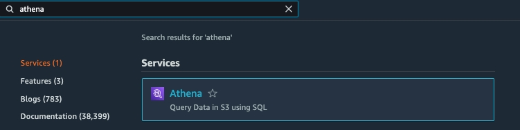

Athena uses S3 to store query results. Set up the location Athena will use from now going forward:

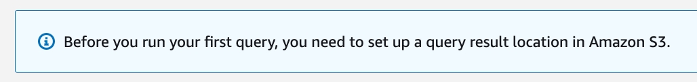

Click the View Settings button:

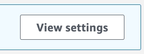

Enter the full S3 path you want Athena to save query results. Encryption makes it less likely that sensitive data will be compromised. For this exercise we will skip encryption:

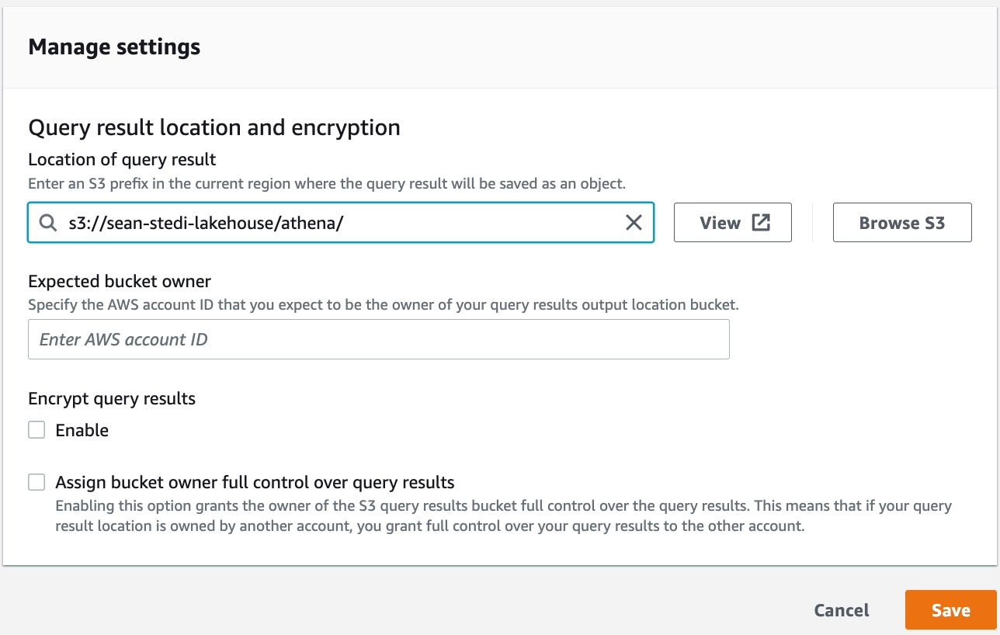

Click the Editor tab:

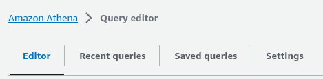

From this menu, click on the Create button and then choose S3 bucket data:

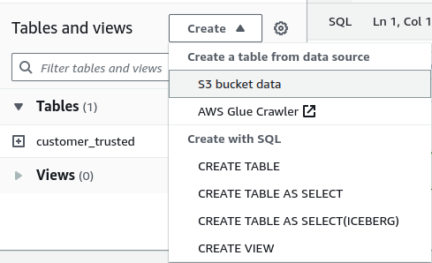

Enter the name of the table you are defining, pick "Create a database", then type in the database name that owns the table

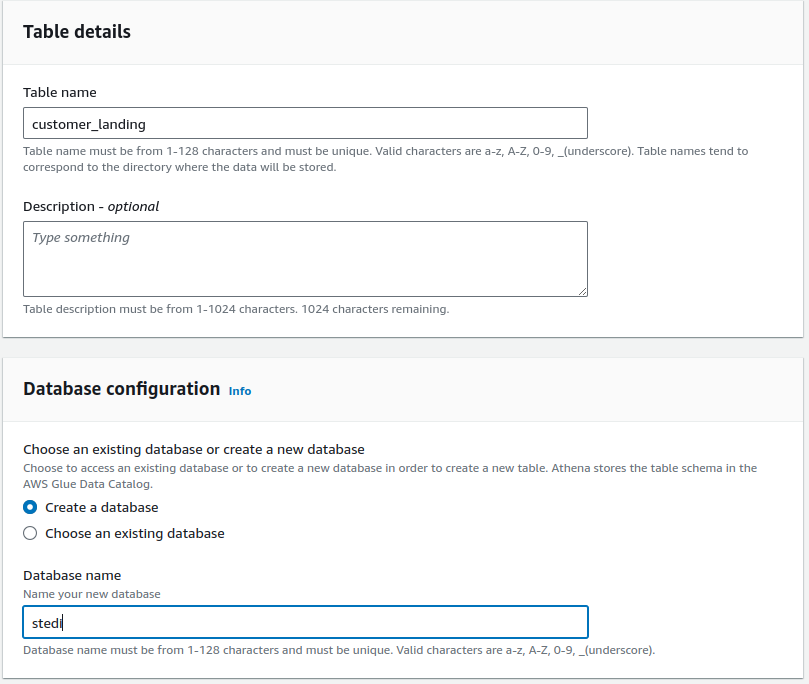

Choose the directory that contains the physical landing zone data

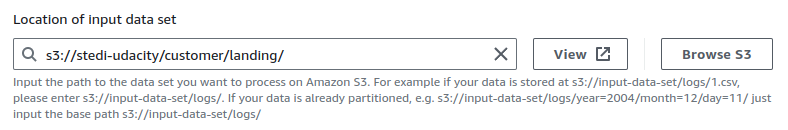

Choose JSON for the data format for your customer landing zone data, leave everything else as default

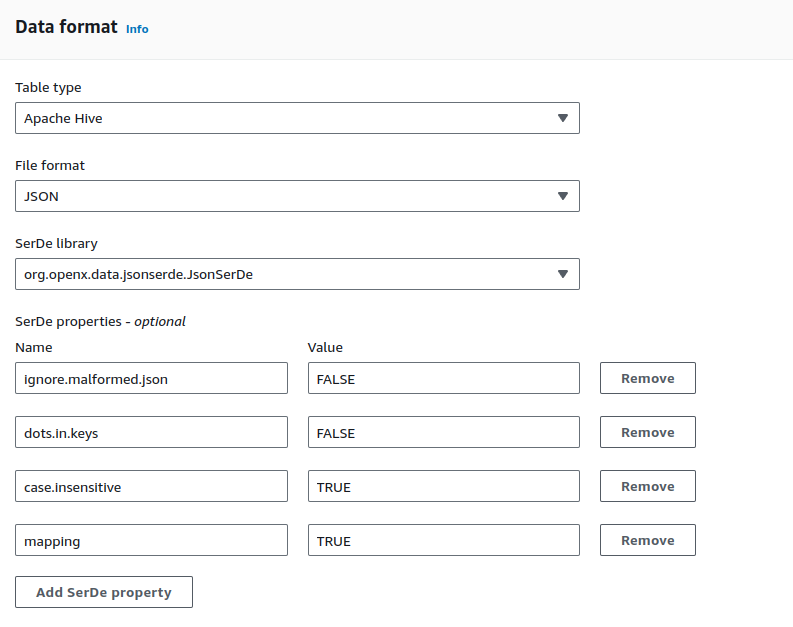

## Define the fields

Look at the sample JSON data below:

```
{
"customerName":"Frank Doshi",
"email":"Frank.Doshi@test.com",
"phone":"8015551212",
"birthDay":"1965-01-01",
"serialNumber":"159a908a-371e-40c1-ba92-dcdea483a6a2",
"registrationDate":1655293787680,
"lastUpdateDate":1655293787680,
"shareWithResearchAsOfDate":1655293787680,
"shareWithPublicAsOfDate":1655293787680,
"shareWithFriendsAsOfDate":1655293788443
}
```

Using the sample record above, define the fields in the glue table, and click Create table

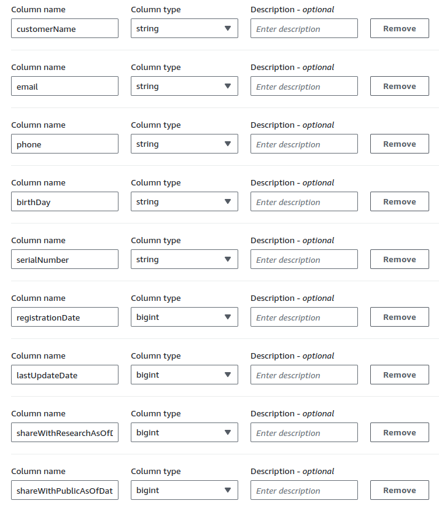

In the Editor tab, pick the database you have just created. Enter a simple query like: `select * from customer_landing` and click run

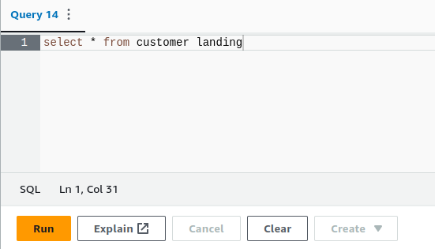

Now that you see results, you can use any desired SQL query parameters further refine your query and analyze the data in the landing zone:

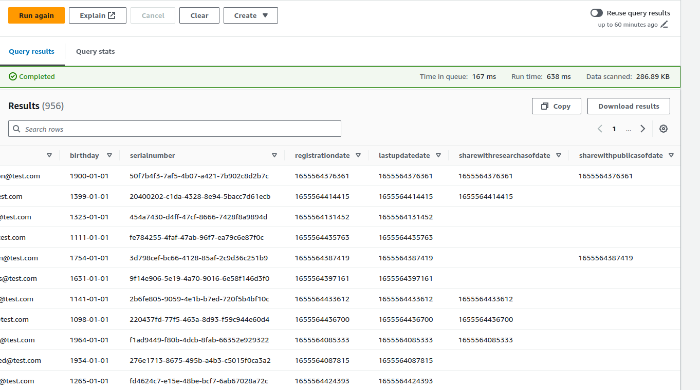

> Keep the rest of the page content (**Irregular Data** and **Reverse Engineer a Table**).

> Change 2: Add the following section at the end.

## Configure a Glue Job to generate a table definition automatically

In the exercise from a previous lesson, you have created the customer_trusted table by running a Glue Job that gets data from an S3 bucket. Notice that the table definition is created automatically by that Glue Job:

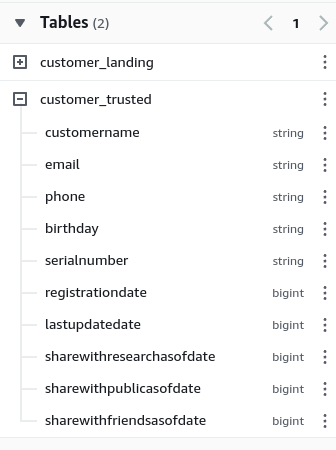
