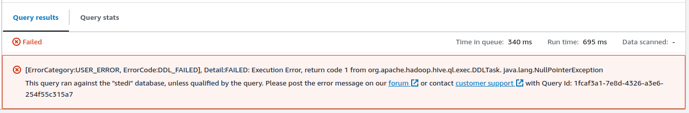

> Add this content before the video

**Note:** The solution video shows you how to do this via AWS Glue Data Catalog rather than through Athena. As of the time of writing, the table generated with this method does not support the "Generate table DDL" feature. You would get an error as follows due to the existence of `NULL` values:

