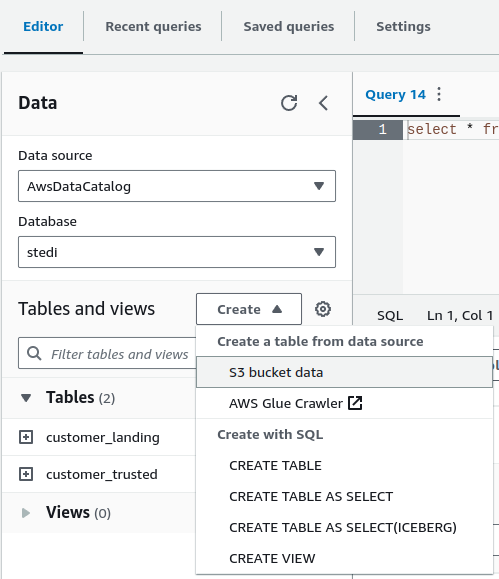
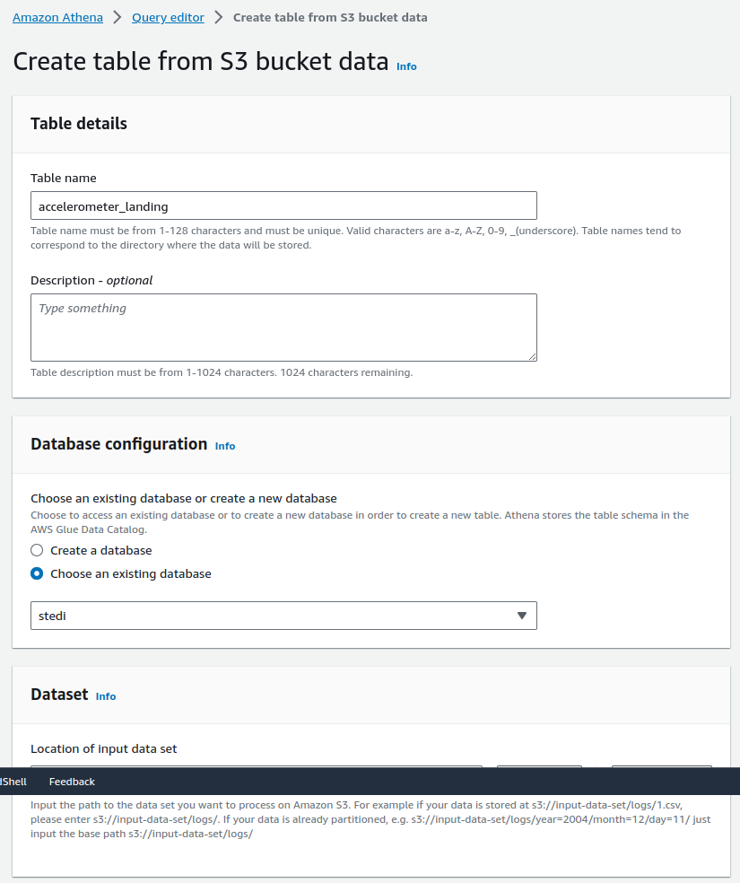
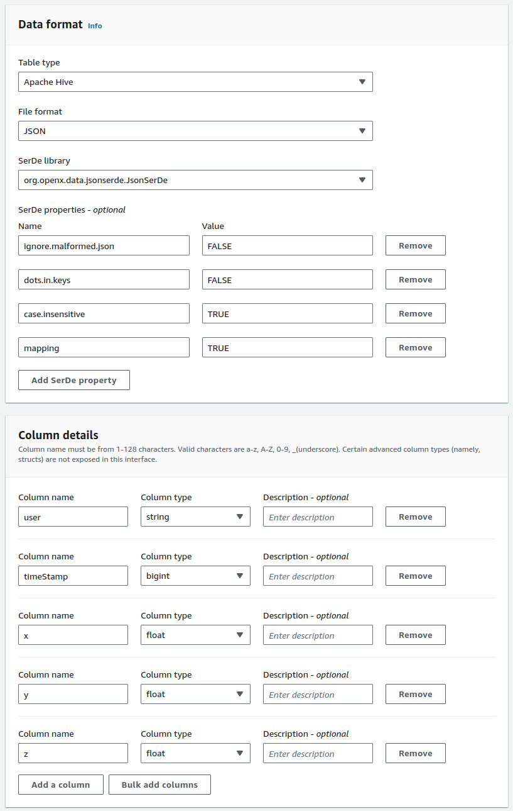
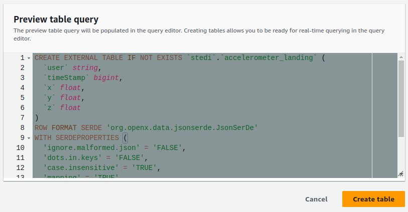
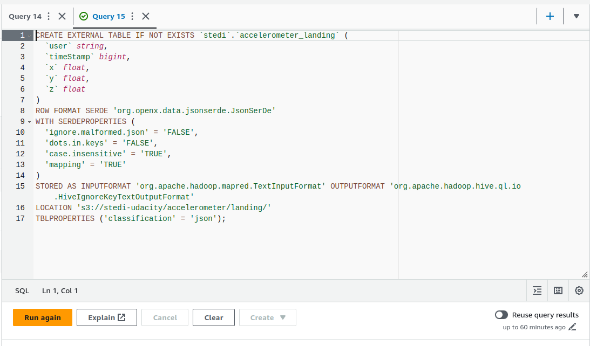

> Change 1: Change the images (compare the descriptions with the alts of the images below)

> Change 2: Replace this text:

> Copy the table query, and save it as accelerometer_landing.sql, then push it to your GitHub repository:

Copy the table query, and save it as accelerometer_landing.sql, then include it in your project submission:

