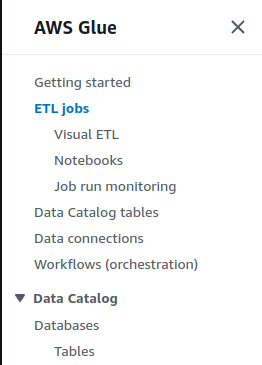
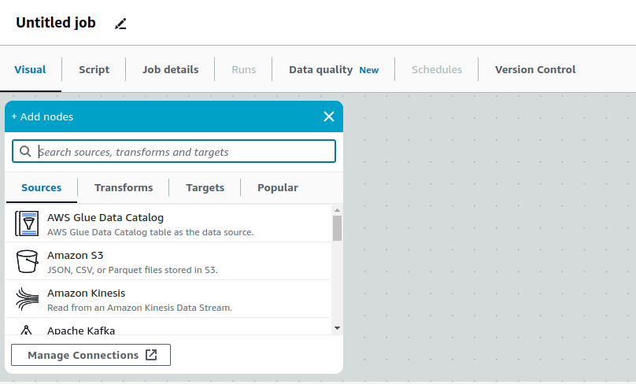
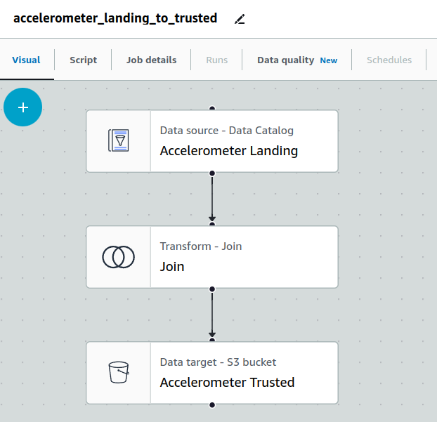
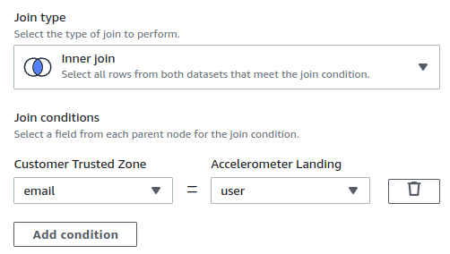
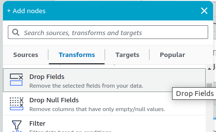
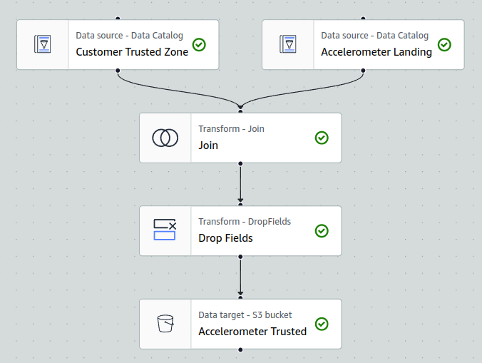
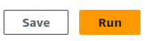

> Change 1: Replace the content starting from below the "Click the Hamburger menu" message

Click **ETL Jobs**

Click **Visual ETL** to create a blank Glue Job through the visual ETL editor.

You should see an **empty** visual data flow

## Configure the Job

Define Names for:

- Job (accelerometer_landing_to_trusted)
- Accelerometer Landing Node
- Join Customer Node
- Accelerometer Trusted Node

Define:

- IAM Role
- Job name
- Data Source Data Catalog table (accelerometer_landing)

The Visual Graph should look similar to this (**we're not finished!**):

- Data source type is Data Catalog (the accelerometer_landing table we created earlier)
- Transform - Join Node to join accelerometer and customer tables
- Data target defaulted to S3

We need the **Customer Trusted Zone Data Catalog datasource**. Click the Source dropdown, click AWS Glue Data Catalog:

- Configure the AWS Glue Data Catalog datasource to point to the **Customer Trusted** table
- Name the Node (**Customer Trusted Zone**)

**Note:** You may use an Amazon S3 Node instead, but a Data Catalog Node is more consistent and you would make use of the meta data from the table you have created earlier (at the end of the **Use Glue Catalog to Query a Landing Zone** page).

In your Join Customer Node, add the **Customer Trusted Zone** Node as an additional parent

Click Add Condition

Choose the join fields you identified earlier to join accelerometer and customer

Congratulations! You have created a join that will automatically drop Accelerometer rows unless they can be joined to a customer record in the **Trusted Zone**:

## Accelerometer Trusted Zone

- Click the **Accelerometer Trusted** Node
- Choose the **JSON** format
- Leave Compression Type **None**
- Add the new S3 path to the Accelerometer Trusted Zone: be sure it ends with a /
- **Create a table in the Data Catalog and on subsequent runs, update the schema and add new partitions**
- Pick the appropriate database
- Table name **accelerometer_trusted**

### Previewing the output schema

On the bottom pane, you may see two tabs, **Data preview** and **Output schema**. The former allows you to run the Glue Job with some sample rows and the latter displays the output schema of the selected node.

Click output schema to see the generated schema, notice the fields from **both** tables appear

> The rest of the content should be the same, but update the images

> Change 2: Add the following at the bottom of the page

When running the COUNT(*) query, you should get 40981 rows

