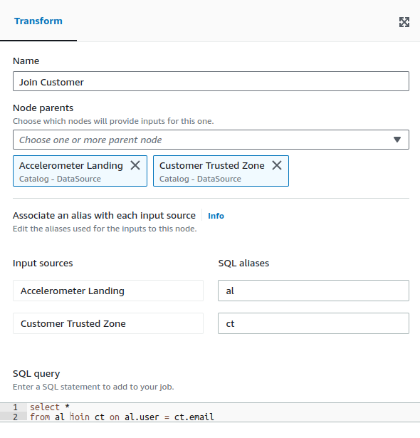

> Change 1: Replace the content starting from below the "Click the Hamburger menu" message

Click **ETL Jobs**


Click **Visual ETL** to create a blank Glue Job through the visual ETL editor.


You should see an **empty** visual data flow


## Configure the Job

Define Names for:

- Job (accelerometer_landing_to_trusted)
- Accelerometer Landing Node
- Join Customer Node
- Accelerometer Trusted Node

Define:

- IAM Role
- Job name
- Data Source Data Catalog table (accelerometer_landing)

The Visual Graph should look similar to this (**we're not finished!**):

- Data source type is Data Catalog (the accelerometer_landing table we created earlier)
- Transform - SQL Query Node to join accelerometer and customer tables
- Data target defaulted to S3

**Note:** You may use a Join Node instead but it sometimes does not work as expected when the parent sources have duplicates. On the other hand, the Join Node allows you to view the output schema right away, whereas with the SQL Query Node, you will need to run a data preview before you can view the output schema. More details on how to do this are provided below.


We need the **Customer Trusted Zone Data Catalog datasource**. Click the Source dropdown, click AWS Glue Data Catalog:


- Configure the AWS Glue Data Catalog datasource to point to the **Customer Trusted** table
- Name the Node (**Customer Trusted Zone**)

**Note:** You may use an Amazon S3 Node instead, but a Data Catalog Node is more consistent and you would make use of the meta data from the table you have created earlier.

- In your Join Customer Node, add the Customer Trusted Zone Node as an additional parent
- Set SQL aliases for your input sources
- Update the SQL query to perform an inner join between the two tables



Congratulations! You have created a join that will automatically drop Accelerometer rows unless they can be joined to a customer record in the Trusted Zone:


## Accelerometer Trusted Zone

- Click the **Accelerometer Trusted** Node
- Choose the **JSON** format
- Leave Compression Type **None**
- Add the new S3 path to the Accelerometer Trusted Zone: be sure it ends with a /
- **Create a table in the Data Catalog and on subsequent runs, update the schema and add new partitions**
- Pick the appropriate database
- Table name **accelerometer_trusted**

### Glue Table
In the previous exercises, we used the Glue Console and the Athena Query editor to define a Glue Table. In this exercise, the Accelerometer Trusted Zone table is once again created via the Glue Console.

### Previewing the output schema

On the bottom pane, you may see two tabs, Data preview and Output schema. The former allows you to run the Glue Job with 20 sample rows, while the latter displays the output schema of the selected node.

There's a caveat, though: the output schema feature does not work with the SQL Query Node. To workaround this, run a data preview, then click the **Use datapreview schema** button in the Output schema tab.

You should then see the generated schema, notice the fields from **both** tables appear


Update your SQL Query node to choose only the fields from Accelerometer Trusted

```
select al.*
from al join ct on al.user = ct.email
```


Click **Save** and then click **Run**


After the job successfully runs, a new Glue Table should appear in the Athena query editor.

When running the COUNT(*) query, you should get 40981 rows


