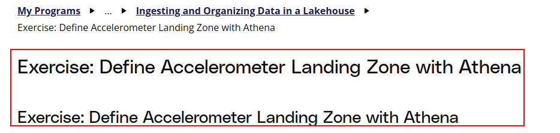

# Duplicated headers issue

Many pages have duplicated headers e.g.

Please update the following pages:

- 4. Exercise: Define a Landing Zone Table
- 6. Exercise: Define Accelerometer Landing Zone with Athena
- 7. Data Privacy in Data Lakes
- 8. Exercise: Athena Joins with Glue Catalog
- 14. Solution: Curated Composite
- 15. Lesson Review
