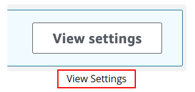
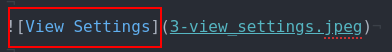

1. Go through each folder and see the changes in md files there.
2. I put the image descriptions as image Alts. Look out for them either from inspect element or the Markdown Code directly. For example, this is how the text will show on the site:

That image is available here:

